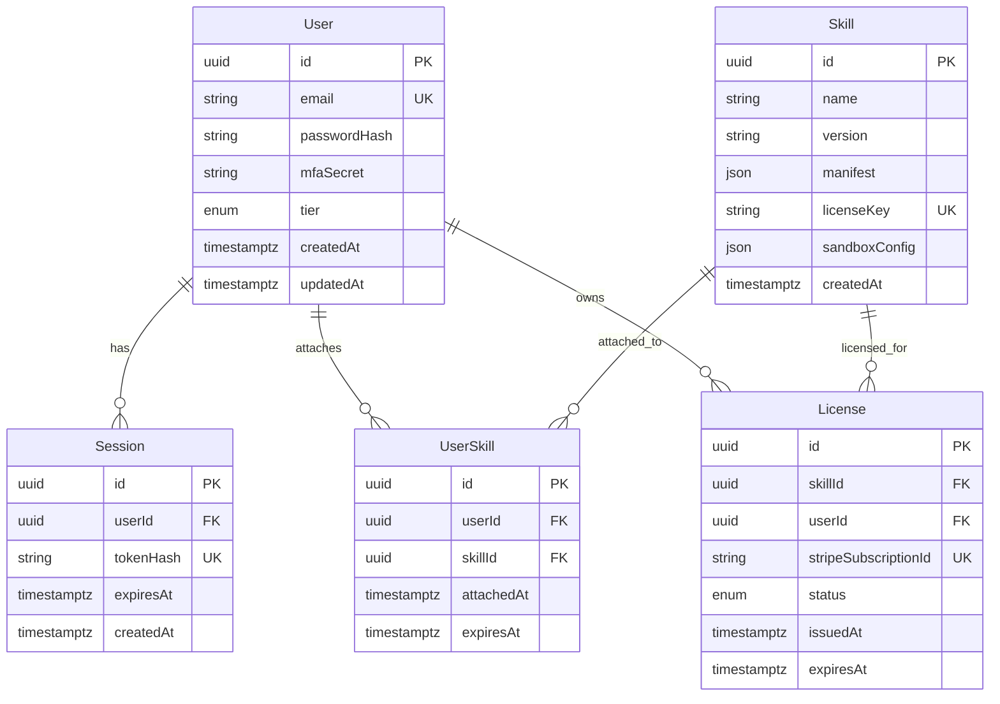

# Database Schema v1

## Overview

This schema covers the Phase 1 relational core for authentication, skill attachment, and licensing.

- Database: PostgreSQL
- ORM: Prisma
- Primary keys: UUID on every table
- Timestamp strategy: UTC timestamps via database/application defaults
- Immutability approach: sessions and licenses are modeled as historical records; destructive cascades are limited to non-audit join/session data

## Enums

### `UserTier`

| Value |
|-------|
| `FREE` |
| `PRO` |
| `BUSINESS` |
| `ENTERPRISE` |

### `LicenseStatus`

| Value |
|-------|
| `ACTIVE` |
| `EXPIRED` |
| `CANCELLED` |

## ERD

## Tables

### `User`

| Column | Type | Null | Default | Notes |
|--------|------|------|---------|-------|
| `id` | `uuid` | No | generated UUID | Primary key |
| `email` | `text` | No | - | Unique login identifier |
| `passwordHash` | `text` | No | - | Password hash only, never plaintext |
| `mfaSecret` | `text` | No | - | MFA seed/secret storage |
| `tier` | `UserTier` | No | `FREE` | Subscription tier enum |
| `createdAt` | `timestamptz` | No | current timestamp | Creation audit |
| `updatedAt` | `timestamptz` | No | current timestamp | Last update audit |

Indexes and constraints:

- Primary key on `id`
- Unique index on `email`
- Index on `tier`
- Index on `createdAt`

### `Session`

| Column | Type | Null | Default | Notes |
|--------|------|------|---------|-------|
| `id` | `uuid` | No | generated UUID | Primary key |
| `userId` | `uuid` | No | - | FK to `User.id` |
| `tokenHash` | `text` | No | - | Hashed session token |
| `expiresAt` | `timestamptz` | No | - | Session expiry |
| `createdAt` | `timestamptz` | No | current timestamp | Creation audit |

Indexes and constraints:

- Primary key on `id`
- Index on `userId`
- Unique index on `tokenHash`
- Index on `expiresAt`
- Composite index on `userId, expiresAt`

Foreign keys:

- `userId -> User.id` with `ON DELETE CASCADE`, `ON UPDATE CASCADE`

### `Skill`

| Column | Type | Null | Default | Notes |
|--------|------|------|---------|-------|
| `id` | `uuid` | No | generated UUID | Primary key |
| `name` | `text` | No | - | Logical skill name |
| `version` | `text` | No | - | Version string |
| `manifest` | `jsonb` | No | - | Skill manifest payload |
| `licenseKey` | `text` | No | - | Unique licensing key/reference |
| `sandboxConfig` | `jsonb` | No | - | Runtime sandbox policy/config |
| `createdAt` | `timestamptz` | No | current timestamp | Creation audit |

Indexes and constraints:

- Primary key on `id`
- Unique index on `licenseKey`
- Unique composite index on `name, version`
- Index on `createdAt`

### `UserSkill`

| Column | Type | Null | Default | Notes |
|--------|------|------|---------|-------|
| `id` | `uuid` | No | generated UUID | Primary key |
| `userId` | `uuid` | No | - | FK to `User.id` |
| `skillId` | `uuid` | No | - | FK to `Skill.id` |
| `attachedAt` | `timestamptz` | No | current timestamp | Attachment timestamp |
| `expiresAt` | `timestamptz` | Yes | `null` | Optional attachment expiry |

Indexes and constraints:

- Primary key on `id`
- Index on `userId`
- Index on `skillId`
- Composite unique index on `userId, skillId`
- Composite index on `userId, expiresAt`
- Composite index on `skillId, expiresAt`

Foreign keys:

- `userId -> User.id` with `ON DELETE CASCADE`, `ON UPDATE CASCADE`
- `skillId -> Skill.id` with `ON DELETE CASCADE`, `ON UPDATE CASCADE`

### `License`

| Column | Type | Null | Default | Notes |
|--------|------|------|---------|-------|
| `id` | `uuid` | No | generated UUID | Primary key |
| `skillId` | `uuid` | No | - | FK to `Skill.id` |
| `userId` | `uuid` | No | - | FK to `User.id` |
| `stripeSubscriptionId` | `text` | No | - | Billing subscription reference |
| `status` | `LicenseStatus` | No | - | Current license state |
| `issuedAt` | `timestamptz` | No | current timestamp | License issue time |
| `expiresAt` | `timestamptz` | Yes | `null` | Optional expiration |

Indexes and constraints:

- Primary key on `id`
- Index on `skillId`
- Index on `userId`
- Unique index on `stripeSubscriptionId`
- Index on `status`
- Index on `expiresAt`
- Composite index on `userId, status`
- Composite index on `skillId, status`

Foreign keys:

- `skillId -> Skill.id` with `ON DELETE RESTRICT`, `ON UPDATE CASCADE`
- `userId -> User.id` with `ON DELETE RESTRICT`, `ON UPDATE CASCADE`

## Relationship Rationale

- `User -> Session`: cascade delete to ensure session cleanup when a user is removed.
- `User -> UserSkill` and `Skill -> UserSkill`: cascade delete because `UserSkill` is a pure attachment/join record.
- `User -> License` and `Skill -> License`: restrict delete to preserve billing and entitlement history, supporting immutable record retention.

## Query Patterns Covered by Indexes

- Authenticate user by `email`
- Resolve current sessions by `tokenHash` and expire sessions by `expiresAt`
- List sessions for a user ordered/filterable by `expiresAt`
- Resolve a skill by `licenseKey` or `name + version`
- List skills attached to a user and expiring attachments
- List active licenses by user or by skill
- Reconcile Stripe subscriptions by `stripeSubscriptionId`
